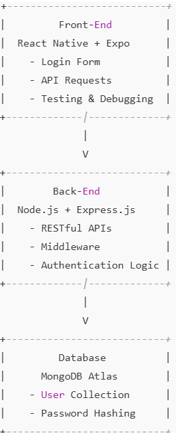

# System Inception

## Table of Contents
* Requirements
  * [Functional Requirements](#functional-requirements)
  * [Nonfunctional Requirements](#nonfunctional-requirements)
  * [Security Requirements](#security-requirements)
* [Technology Plan](#technology-plan)
* Risk Analysis
  * [Technical Risk by Business Goal](#technical-risk-by-business-goal)
  * [Risk Mitigation Plan](#risk-mitigation-plan)
* [Effort Estimate](#effort-estimate)
* [Architectural Design](#architectural-design)

## Requirements

  <h3>Functional Requirements</h3>

The following actors and use cases have been identified for the Drury Commons Menu application.

#### Actors
| Actor | Description |
|-------|-------------|
| User | A user is a student who uses the app to view the menu and can view allergens of food items. |

#### Use Cases
* View Menu - A user can look at the menu, which should contain the name, the station it is served at, and any dietary restrictions an item might have.

  <h3>Nonfunctional Requirements</h3>

The following nonfunctional requirements will be satisfied.

* Users will be able to see any restrictions a menu item might contain to assist students with allergies.
* The menu will be readable and scrollable on common cell phone and tablet devices.
* The app will also be able to change what menu is seen (EX: changing for breakfast, lunch, and dinner and to look ahead no matter the time)

  <h3>Security Requirements</h3>

The following security requirements will be satisfied.

* Data Encryption: All senstitive data that is exchanged between users will be encrpyted using HTTPS and Transport Layer Security (TLS) to protect against eavesdropping and data tampering.
* Input Validation: All of the users' input will be validated and sanitized to prevent malicious data from being processed. 
* User Authentication: All users will authenticate using secure credentials (user name and password). Passwords will be stored using strong hashing algorithms.

  <h2>Technology Plan</h2>

The following technology plan lists potential technologies to be used in the creation of our application and a personal experience rating for each technology.

| Technology                      | Experience Rating       |
|---------------------------------|-------------------------|
| **Mobile App Technologies**     |                         |
| React                           | Moderate                |
| Expo                            | Moderate                |
| **Application and Web Development** |                     |
| JavaScript                     | Moderate                |
| **Web Server Scripting**        |                         |
| Node.js                        | Moderate                |

## Risk Analysis

 <h3>Technical Risk by Business Goal</h3>

The following technical risks and business goals have been identified and prioritized.

| ID         | Technical Risk                                                       | Business-Market | Business-Users | Business-Value |
|------------|---------------------------------------------------------------------|-----------------|-----------------|-----------------|
| Tech-R-1   | Limited experience developing mobile apps using React and Expo.     | -               | H               | H               |
| Tech-R-2   | No experience implementing role-based access control in the app.    | -               | H               | H               |
| Tech-R-3   | Ensuring data encryption and secure communication over HTTPS.        | M               | H               | H               |
| Tech-R-4   | Tools needed for the project (e.g., React, Expo, Node.js) are new. | M               | H               | H               |
| Tech-R-5   | Time for the developer to work on the project is limited due to class demands. | M               | -               | -               |
| Tech-R-6   | Inadequate testing may not cover all security requirements.          | L               | -               | -               |
| Tech-R-7   | The app is susceptible to input validation issues and XSS attacks.  | M               | -               | -               |

  <h3>Risk Mitigation Plan</h3>

The following risk mitigation plan will help us to address and mitigate these risks to the extent possible.
 
| ID | Risk | Mitigation |
|----|------|------------|
| Tech-R-1 | Limited experience developing mobile apps. | Research and learn through online tutorials |
| Tech-R-2 | No experience implementing role-based access control in the app. | Research and learn through online tutorials |
| Tech-R-3 | Ensuring data encryption and secure communication over HTTPS. | Search for information and tutorials online |
| Tech-R-4 | Tools needed for the project (e.g., React, Expo, Node.js) are new. | Research and learn these tools using tutorials found online |
| Tech-R-5 | Time for the developer to work on the project is limited due to class demands. | Make sure sprints are evenly and thoroughly planned out as to not fall behind |
| Tech-R-6 | Inadequate testing does not cover requirements | Utilize automated testing tools. Make testing a priority activity |
| Tech-R-7 | The app is susceptible to input validation issues and XSS attacks. | Research ways to prevent such attacks an implement them |

 

 <h2>Effort Estimate</h2>

The following effort estimate has been calculated using NOP (nominal object points) using the following categories of work to be done - screens, reports (none), and 3GL components.

| Artifacts | Complexity | Object Points | Notes |
|-----------|------------|---------------|-------|
| **Menu Screen** | | | |
| Fetch API Data | Medium | 2 | Fetch menu data from the fresh ideas API |
| Parse and Display Data | High | 3 | Display data in a readable format on menu scree |
| Navigation Between Meal Periods | Medium | 2 | Switch between breakfast, lunch, and dinner |
| **Login Screen** | | | |
|    Authentication Routes | High | 3 | Build login, signup, logout routes  |
|    Middleware for Route Protection | Medium | 2 | Implement JWT-based authetication |
|    Error Handling  | Simple | 1 | Add detiled error responses or auth endpoints |
| **MongoDB Integration** | | | | 
| Connection and schema setup | Medium | 2 | Define Models (User Schema) |
| CRUD Operations | Simple | 1 | Implement basic database operations |
| Test database interactions | Simple | 1 | Debug, connection issues |
| **Total Object Points** | | 17 | |

 <h2>Architectural Design</h2>

The following deployment diagram represents the architectural (high-level) design of the Dining Hall Appliation.

The basic architecture of the Dining Hall app has four components: a component that runs on a mobile device, a map server, an administrative component, and a server component. Components will communicate over the Internet. The details of the architecture are specified in Figure 7.5. Notice that the administrative componet-server component communication is specified at two levels. The devices communicate using the Internet while the browser and the web server communicate using the http protocol.
